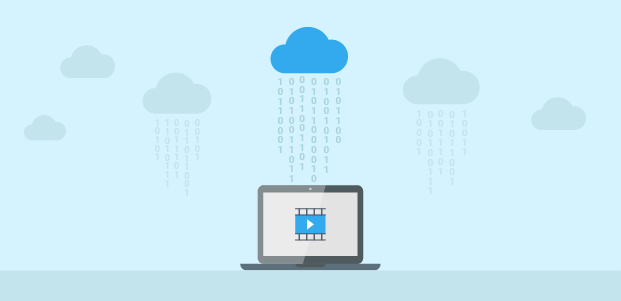
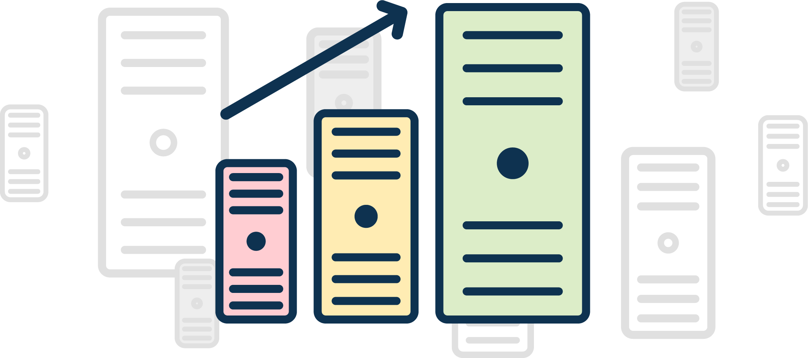

# Intro to Apache Kafa
May 31, 2020

### Streaming
To understand how kafka lets first understand what is meant by streaming, because kafka is basically a distributed *streaming* platform.

To keep it simple streaming is just like a running stream of water like a river dumping water in a bay. The water is continously flowing and the bay just keeps recieving it and storing it. Similary, when you watch netflix or spotify, stream of data hits your device rather than the whole movie at once *thats downloading*. This stream comes in form of bits and bytes and your computer downloads these small pieces and turns it into your favorite show. Sometimes, if your internet is slow, the bits and peices are not downloaded and you experience, what we call, **buffering**.

When it comes to kafka this in form of getting the data from web logs or censor data to your hadoop cluster or database in a scalable manner so that we can do some processing on it.

### What is kafka

- Kafka is basically a streaming service which helps you load data into your cluster as it is being genereated so rather than loading the data manually it is automatically inserted.

- In deeper terms kafaka is a publish-subscribe messaging system. Kafka stores all incoming messages (data) from publishers and stores them for a period of time to later publish them to a stream of data called topics (categories).

- Kafka consumers subsribe to a topic/category and recieve data for that topic as it is published.

- The benefit kafka shares here is that every topic can have multiple consumers with their own set of position in the stream. eg: suppose you consume 2gb of a certain stream while the other does 1gb you both will have your own position whenever you resume.

- Kafka not only provides realtime data publishing but also lets you start from where you left if you go offline.

### Kafka Architecture

1. Producers: Apps that publish to topics.

2. Consumers: Apps that recieve data from the specific topics.

3. Connectors: Plugin modules for databases which automatically saves messages by inserting rows.

4. Stream Processors: Acts as a modifier. If the prodocuers send out raw data logs, the stream processors takes out the info we need and publish that to a new topic in realtime.

### Kafka Broker

A kafka broker could be understood as an agent that handles requests from all the clients such as producer, consumer etc. and keeps the data replicated in the cluster. So the broker can be understood as the **heart** of a kafka cluster.

So if a producer sends a request to a kafka cluster it goes to the broker that maintains that cluster. The broker further contains topic partitions. 

### Topic Partition

Kafka topics are divided into a number of partitions, which contains messages in an unchangeable seqeunce. Each message in a partition is assigned and identified by its unique offset.

A topic can have mulitple partition logs, which allows consumer to read from topic in parallel.

Partitions also allow us to parallelize a topic by splitting the data in a particular topic across multiple brokers.

The above is achieved by replication among kafka brokers.

Replication is implemented at the partition level and the redundant unit of a topic is called a replica. Each partition usually has one or more replicas meaning that partitions contain messages that are replicated over a few kafka brokers in the cluster.

Each replica has one server acting as a leader and the rest of them as followers. The leader replica handles all read-write requests for the specific partition and the followers replicate the leader. If the leader server fails then any of the follower server takes up.

### Scaling

One of the greatest features of kafka is its ability to scale invariably.

Kafka can have many clusters so that we dont have one point of failure.

- Kafka can be distributed among many servers. Which inturn distributes the storage of stream data as well.

- 

Consumers can also be distributed:
- Consumers of the same group will have messages distributed amongst them.

- Consumers of different groups will get their own copy of each message.

## ETL Timeline

#### Drawbacks of previous ETL tools
 
 1. The need for global schema

 2. Data cleansing and curation is manual and is error prone.

 3. Operational cost of ETL is high.

 4. ETL tools built to connect database to warehouses.

#### The need for Kafka

 - Ability to process high-volume and high-diversity data.

 - Real time from groun up and a transition to event-centric thinking.

 - Enable forward-compatible data architecture, the ability to add more applications that need to process data differently.

#### Why kafka

- Offers a scalable messaging background.

- Enables building streaming piplines.

- Basis for stream processesing.

Also overcomes the following challenges:

- Fault Tolerance

- Parallelism

- Latency

- Delivery Semantics

- Operations and monitoring

- Schema management
